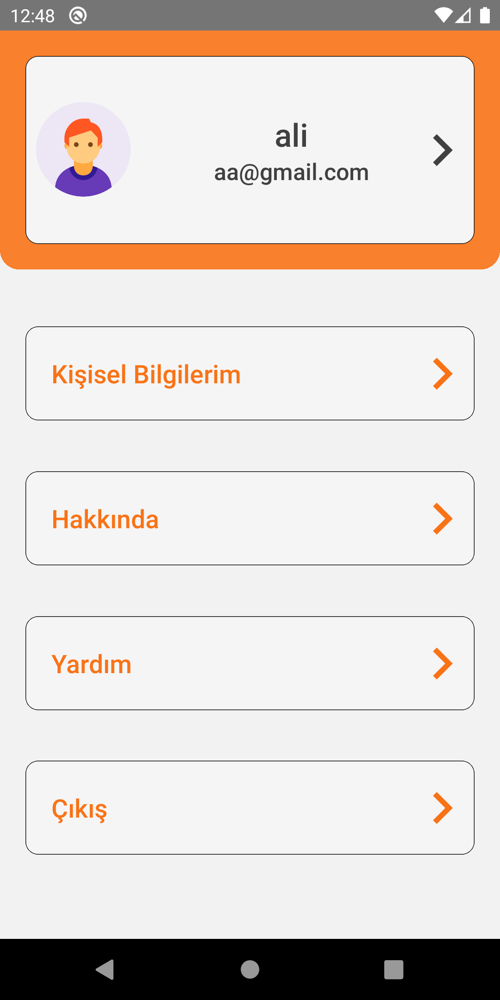
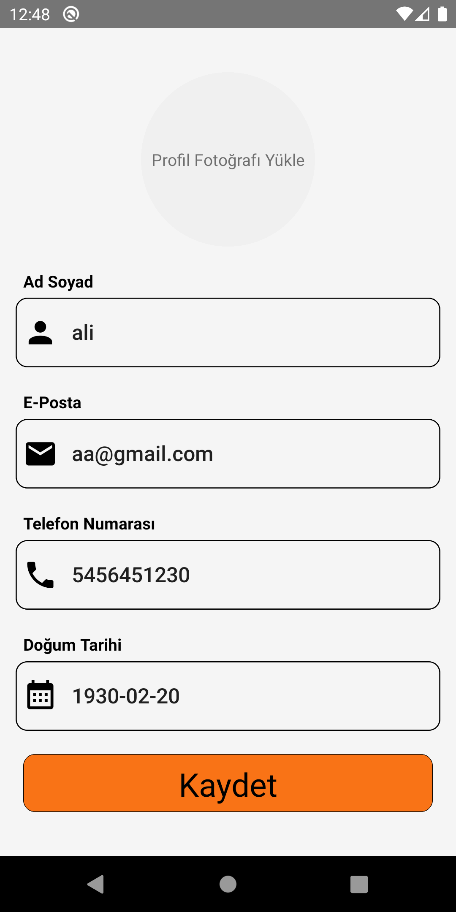

# Travel Buddy Seyahat Uygulaması

**Travel Buddy**, seyahat planlamalarını optimize eden ve seyahat önerileri sunan bir mobil uygulamadır. Bu uygulama ile kullanıcılar seyahatlerini daha verimli hale getirebilir ve farklı destinasyonlar hakkında öneriler alabilirler. Uygulama, React Native ile geliştirilmiş olup, MongoDB ve Node.js teknolojilerini kullanmaktadır.


## Özellikler

- Seyahat planlaması 
- Kullanıcı dostu arayüz ile basit gezinme
- Farklı destinasyonlar hakkında öneriler
- Gerçek zamanlı veri güncellemeleri

## Ekran Görüntüleri

Aşağıda uygulamanın farklı bölümlerine ait ekran görüntülerini bulabilirsiniz:

<div style="display: flex; flex-wrap: wrap;">
    
    
    
    
    
    
</div>

## Kullanılan Teknolojiler

- **Frontend:** React Native
- **Backend:** Node.js ve Express.js (API)
- **Veritabanı:** MongoDB
- **Diğer:** Axios, React Navigation ...

## API

Bu uygulama, API verilerini başka bir GitHub deposundan almaktadır. Aşağıdaki bağlantıdan API deposuna ulaşabilirsiniz:

[API GitHub Repository](https://github.com/uzeyirdemiral/Travel-App-API)

API'nin kurulumu ve çalıştırılması için gerekli adımlar repoda belirtilmiştir.

## Kurulum


Bu projeyi yerel ortamınızda çalıştırmak için aşağıdaki adımları izleyin:

1. Depoyu klonlayın:
   ```bash
   git clone https://github.com/uzeyirdemiral/Travel-App.git

2. Proje dizinine gidin:
   ```bash
   cd Travel-App

3. Gerekli bağımlılıkları yükleyin:
   ```bash
   npm install
   
4. Uygulamasını başlatın:
   ```bash
   npm start

5. API Bağlantısı Yapın:

   API'yi çalıştırmak için yukarıda belirtilen API GitHub deposundaki talimatları izleyin. API bağlantı bilgilerini .env dosyasında ayarlamayı unutmayın.


## Çevre Değişkenleri

API anahtarları ve diğer hassas bilgiler `.env` dosyasında saklanmalıdır:

   ```bash
   API_URL=<Your API URL>
